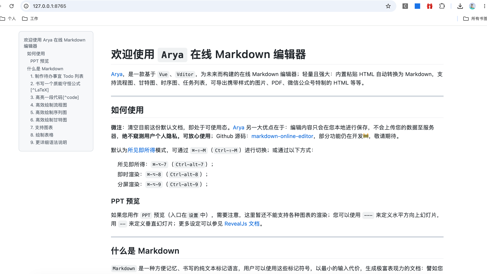

# MarkdownPreviewEnhanced

> Package id: **MarkdownPreviewEnhanced**  
> Browser-first live Markdown preview for Sublime Text — zero install dependencies.



## Features

| Feature | Status |
|--------|--------|
| GitHub-inspired full HTML+CSS rendering | ✅ |
| Live refresh (preserves scroll position) | ✅ |
| Mermaid diagrams (flowchart, sequence, gantt, …) | ✅ |
| ECharts charts (pie, bar, line, scatter, …) | ✅ |
| KaTeX math rendering (`$...$`, `$$...$$`) | ✅ |
| GFM task lists (`- [ ]` / `- [x]`) | ✅ |
| Footnotes (`[^1]`) | ✅ |
| YAML frontmatter stripping | ✅ |
| TOC sidebar (sticky outline of headings) | ✅ |
| Code syntax highlighting (Pygments) | ✅ |
| Scroll sync (editor ↔ preview) | ✅ |
| Export to standalone HTML | ✅ |
| Export to PDF (headless Chrome) | ✅ |
| Relative image resolution (`./img/a.png`) | ✅ |
| Cross-platform (macOS / Windows / Linux) | ✅ |
| Dark mode friendly | ✅ |
| Zero install dependencies (all vendored) | ✅ |

## Requirements

- Sublime Text 4 (Build 4107+)
- **Nothing else** — python-markdown, Pygments, KaTeX, Mermaid, ECharts are all vendored
- Chrome / Chromium optional — PDF export only

## Usage

1. Open a `.md` file.
2. Press `Ctrl+Shift+M` (Windows/Linux) / `Cmd+Shift+M` (macOS).
3. A browser tab opens with the live preview.
4. Edit the markdown — the body updates every 5s without losing scroll.
5. Press the shortcut again to **focus the existing preview tab** (and refresh).
   Use **Close Preview** to close the tab and stop the local server.

### Shortcuts

| macOS | Windows/Linux | Action |
|-------|---------------|--------|
| `Cmd+Shift+M` | `Ctrl+Shift+M` | Toggle Preview |
| `Cmd+Shift+Alt+M` | `Ctrl+Shift+Alt+M` | Close Preview |
| `Cmd+Shift+E` | `Ctrl+Shift+E` | Export HTML |
| `Cmd+Shift+Ctrl+E` | `Ctrl+Shift+Alt+E` | Export PDF |

### Commands

| Command | Description |
| --- | --- |
| `MarkdownPreviewEnhanced: Toggle Preview` | Open / focus browser preview |
| `MarkdownPreviewEnhanced: Close Preview` | Close preview and stop server |
| `MarkdownPreviewEnhanced: Refresh Preview` | Force re-render |
| `MarkdownPreviewEnhanced: Export HTML…` | Write a standalone HTML file |
| `MarkdownPreviewEnhanced: Export PDF…` | Print to PDF via headless Chrome |

### Settings

Preferences → Package Settings → **MarkdownPreviewEnhanced** → Settings

| Setting | Default | Description |
| --- | --- | --- |
| `mermaid_theme` | `"default"` | `default`, `dark`, `forest`, `neutral` |
| `output_dir` | `""` | Empty = Sublime cache |
| `use_local_server` | `true` | Local HTTP server for refresh / images / scroll sync |
| `server_port` | `8765` | Preferred port (tries next ports if busy) |
| `server_idle_seconds` | `45` | Auto-stop server after no browser activity (`0` = only on Close) |
| `browser` | `"auto"` | `auto`, `default`, `chrome`, `safari`, `firefox`, `edge`, … |
| `debounce_ms` | `500` | Live re-render debounce |
| `show_toc` | `true` | Sticky TOC sidebar |
| `enable_katex` | `true` | Math rendering (local KaTeX only) |
| `enable_task_lists` | `true` | `- [ ]` / `- [x]` |
| `enable_footnotes` | `true` | `[^1]` footnotes |
| `strip_frontmatter` | `true` | Strip leading YAML `---` blocks |
| `scroll_sync` | `true` | Editor ↔ preview scroll (needs local server) |
| `custom_css` | `""` | Path to extra CSS file |

View-level override example:

```jsonc
{
    "markdown_preview_enhanced.mermaid_theme": "forest"
}
```

## Installation

### Package Control

Command Palette → `Package Control: Install Package` → `MarkdownPreviewEnhanced`
(once accepted on the default channel).

### Manual

Clone or copy this repository **as** the package folder
`Packages/MarkdownPreviewEnhanced/` (repo root = package root):

| Platform | Path |
| --- | --- |
| macOS | `~/Library/Application Support/Sublime Text/Packages/MarkdownPreviewEnhanced/` |
| Linux | `~/.config/sublime-text/Packages/MarkdownPreviewEnhanced/` |
| Windows | `%APPDATA%\Sublime Text\Packages\MarkdownPreviewEnhanced\` |

## Development

```bash
./build.sh                    # rsync package files into ST Packages/
./release.sh 1.2.0            # tag + push + Package Control PR
./release.sh 1.2.0 --dry-run  # preview only
```

`release.sh` updates only this package's entry in the channel file (no full
reformat). Channel metadata is minimal (`details` + `releases`).

### Debug logs

Under `output_dir` (default: Sublime cache `MarkdownPreviewEnhanced/`):

| File | Content |
| --- | --- |
| `preview.html` | Live shell HTML |
| `body.html` | Last body fragment |
| `debug.log` | Timestamped logs |

## License

MIT — see [LICENSE](LICENSE).
